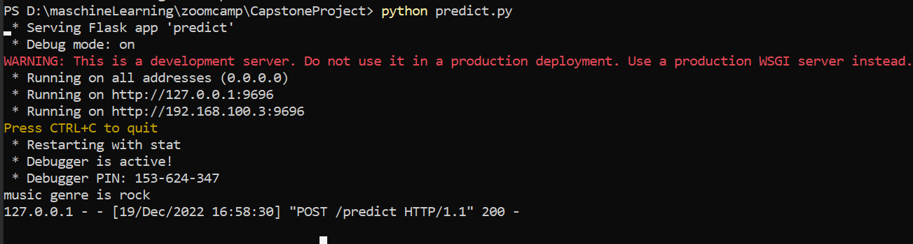
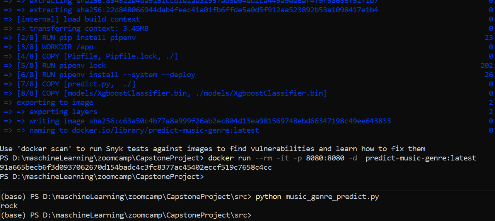

# mlzoomcamp-2022-CapstoneProject-Music-Genre

This is a Capstone project for ML Zoomcamp 2022 (TODO: classify music  into genres)

## Problem description

This is a classification problem. We classify music into 10 genres, using different audio features 
such as acousticness, danceability, duration_ms, energy, instrumentalness, 
liveness, loudness, mode, popularity, speechiness, tempo, valence.

For solve this problem we use different models for multiclass classification such as Random Forest, XGBoost
 and KNeighbors.

## Dataset

This project based on [Prediction of music genre] 
(https://www.kaggle.com/datasets/vicsuperman/prediction-of-music-genre). 
The full list of genres included in the CSV are 'Electronic', 'Anime', 'Jazz', 'Alternative', 
'Country', 'Rap', 'Blues', 'Rock', 'Classical', 'Hip-Hop'.
Set of audio features provided by Spotify.

## Descriptions

Project folder contains

* data
* images
* models
* notebooks
  * MusicGenreEDA+DataPreparation.ipynb
  * Music_genre_model_training_and_data_preparation
  * Music_Genre_predict.ipynb
* src
  * model_training.py
  * music_genre_predict.py
  * music_genre_predict_dev.py
* Dockerfile
* Pipfile
* Pipfile.lock
* Predict.py
* Readme.md

## Virtual environment
I used pipenv package manager for create a virtual environment and install the dependencies, 
but you feel free to choose any other tools (conda, venv, etc.).
In case pipenv follow the steps below:
1. Open the terminal and choose the project directory.
2. Install pipenv by command 
```sh
pip install pipenv
```
3. Install all packages with 
```sh
pipenv install
```
This command create virtual environment 
the same as mine using pipfile.lock.
5. Activate this virtual environment by command
```sh
pipenv shell
```

## Test the service
You can test a model and a service:
1. Open the terminal and choose the project directory.
2. Run the service (development server) by command 
```sh
python predict.py
```
3. Open one more windows with terminal and choose the src folder of project directory.
4. Run the test request with 
```sh
python music_genre_predict_dev.py
```
In this file I add one test music. After run this file you can see a predicted genre 
for this music.
You can change a features for test music and test for your music. I print a predicted 
genre in terminal.
You see something as this:


Alternatively you can run service with waitress
1. Open the terminal and choose the project directory.
2. Run service with waitress:
```sh
waitress-serve --listen=0.0.0.0:8080 predict:app
```
3. Open one more windows with terminal and choose the src folder of project directory.
4. Run the test request with 
```sh
python music_genre_predict.py
```

### Containerization
1. Install the Docker, and it's running on your machine now.
2. Open the terminal and choose the project directory.
3. Build docker image from Dockerfile using 
```sh
docker build -t predict-music-genre:latest .
```
With `-t` parameter we're specifying the tag name of our docker image. 

3. Now use to run service
```sh
docker run --rm -it -p 8080:8080 -d  predict-music-genre:latest
``` 
command to launch the docker container with your app. 
You can use the ID image instead of predict-music-genre:latest. 
You can find ID image with command 
```sh
docker images
```
4. Run music_genre_predict.py to see prediction on given data.

After that you will see following:


